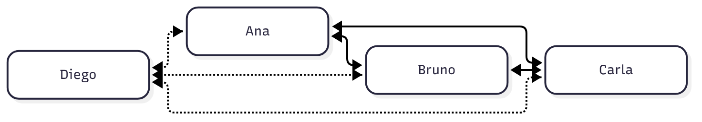
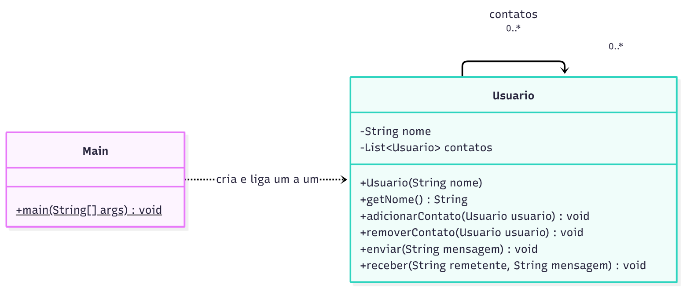
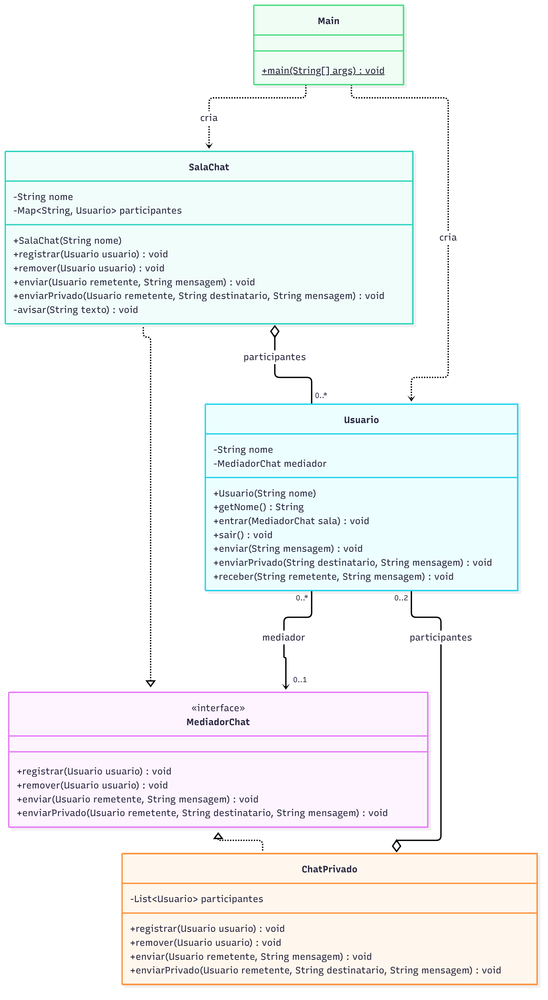
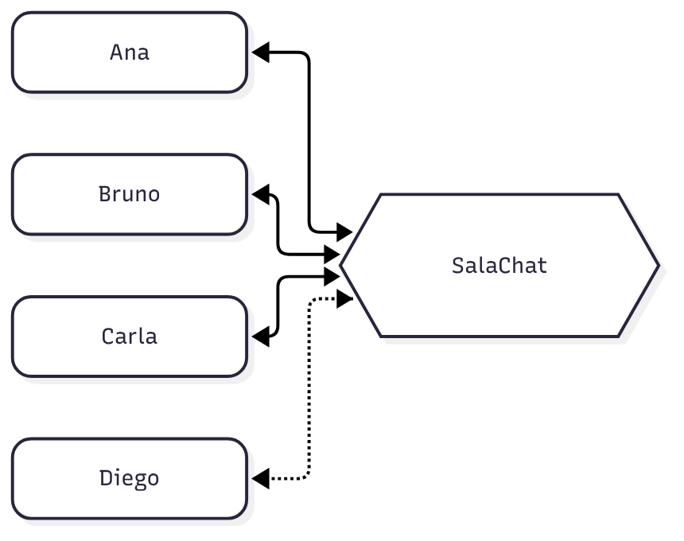

# Atividade 14: Mediator

Aluno: Gabriel Maciel Zavarize

O que tem neste repositório:

- `projeto_mediator_antipattern.zip`: o projeto original, do jeito que foi baixado.
- `projeto-mediator/`: o projeto refatorado com o padrão Mediator (Maven, Java 17).
- `diagramas/`: diagramas de classe de antes e depois da refatoração (PNG e o fonte em Mermaid).

Para rodar o projeto refatorado:

```bash
cd projeto-mediator
mvn compile
java -cp target/classes br.venson.net.designpatterns.mediator.Main
```

No Eclipse/IntelliJ é só importar a pasta `projeto-mediator` e executar a classe `Main`.

## Exercício 1: Aplicações

**1. Sala de chat com dezenas de usuários e regras que mudam com frequência**

Faz sentido usar Mediator. Se cada usuário falasse direto com os outros, teríamos uma malha de referências que cresce de forma quadrática, e as regras (quem fala com quem, sons, privacidade) acabariam espalhadas em todos os usuários. Com a sala como mediadora, cada usuário só conhece a sala, e quando uma regra muda a alteração fica concentrada em um lugar.

**2. Tela de diálogo com widgets que reagem uns aos outros**

Faz sentido usar Mediator. É praticamente o exemplo do livro do GoF: o `Checkbox` não precisa saber que existem um `Botão` e um `Campo de texto`, ele só avisa o diálogo que mudou e o diálogo decide o que acontece com os outros. Isso desfaz a teia de dependências e deixa cada widget reaproveitável em outras telas.

**3. Central de despacho de entregas**

Faz sentido usar Mediator. Motoristas, pedidos e entregas precisam ser coordenados por alguém, e como a regra de alocação muda com frequência é melhor que ela fique na central do que espalhada entre motoristas e pedidos que se conhecem. O cuidado é não deixar a central virar uma classe enorme; a regra de escolha do motorista, por exemplo, pode ficar em uma classe separada e a central só orquestra.

**4. `Impressora` falando com um único `Spooler` fixo**

Não faz sentido usar Mediator. A interação é de um para um, simples e não cresce, então não existe malha nenhuma para desfazer. Colocar um mediador no meio seria só mais uma camada de indireção sem diminuir o acoplamento; uma chamada direta (no máximo por meio de uma interface) resolve.

**5. Classe `Ponto` com `x` e `y`**

Não faz sentido usar Mediator. O `Ponto` só guarda coordenadas e não conversa com nenhum outro objeto, então não há interação para coordenar. Aplicar o padrão aqui seria overengineering.

## Exercício 2: Rastreando o anti-pattern

Rodando o projeto original a saída é:

```
Bruno recebeu de Ana: Bom dia, pessoal!
Carla recebeu de Ana: Bom dia, pessoal!
```

Funciona, mas para isso o `Main` precisou de seis chamadas de `adicionarContato` só para ligar três pessoas.

### 1. Quantas ligações existem para N usuários?

Cada `Usuario` pode ter os outros N-1 na sua lista de `contatos`, então no total são **N x (N-1)** referências. Como cada par de pessoas precisa de duas referências (uma em cada lista), isso dá N x (N-1) / 2 pares. Na prática:

| Usuários | Ligações |
|---|---|
| 3 | 6 |
| 4 | 12 |
| 10 | 90 |
| 50 | 2450 |

O crescimento é quadrático. Isso indica um acoplamento muito alto, do tipo muitos para muitos: cada usuário depende diretamente de vários outros objetos concretos, e qualquer mudança em quem participa da conversa obriga a mexer em vários objetos ao mesmo tempo.



*As linhas pontilhadas são as ligações que aparecem só por causa da entrada do Diego.*

### 2. O que muda para incluir ou remover alguém?

Para incluir o Diego no código original é preciso:

1. criar o objeto `new Usuario("Diego")`;
2. chamar `diego.adicionarContato(...)` para Ana, Bruno e Carla (3 ligações);
3. chamar `ana.adicionarContato(diego)`, `bruno.adicionarContato(diego)` e `carla.adicionarContato(diego)` (mais 3 ligações).

São 6 ligações novas escritas à mão no `Main`. De forma geral, quem entra em uma sala com N pessoas gera 2 x N ligações novas. E se uma dessas linhas for esquecida, a comunicação fica assimétrica: o Diego recebe mensagens da Ana, mas a Ana não recebe as dele, e nada no código acusa o erro.

Para remover a Carla é preciso chamar `removerContato(carla)` em cada um dos outros usuários e ainda limpar a lista da própria Carla. Os problemas que podem sobrar:

- **Referência solta:** se alguém esquecer de remover, a Carla continua recebendo mensagens de uma conversa da qual ela já saiu.
- **Envio depois de sair:** a lista da Carla continua apontando para os outros, então se ela chamar `enviar` a mensagem ainda chega em todo mundo.
- **Memória:** enquanto alguma lista guardar a Carla, o objeto não é liberado pelo garbage collector.
- **Ninguém sabe quem está na sala:** o conceito de sala nem existe no código, então não dá para conferir se a remoção foi completa nem para avisar os outros que ela saiu.

### 3. Onde as regras de conversa deveriam morar?

Hoje a única regra que existe está implícita: recebe a mensagem quem estiver na lista de contatos de quem enviou, e essa lista é montada à mão no `Main`. Se quiséssemos "só o admin fala" ou "mensagem privada", cada `Usuario` teria que ganhar condições para isso, e a mesma regra acabaria repetida em todos os objetos.

Essas regras deveriam ficar no **mediador**, a `SalaChat`. Ela é o único objeto que enxerga a conversa inteira (quem está na sala, quem mandou e para quem), então é o lugar natural para decidir a entrega. Com isso o `Usuario` fica só com a responsabilidade de enviar e receber, e mudar uma regra passa a ser mexer em uma classe só, ou então criar outro mediador com regras diferentes, sem tocar nos usuários.

### 4. Refatoração com Mediator

**Diagrama de classes: antes**



**Diagrama de classes: depois**



O código refatorado está em [`projeto-mediator/src/main/java/br/venson/net/designpatterns/mediator`](projeto-mediator/src/main/java/br/venson/net/designpatterns/mediator):

| Classe | Papel no padrão |
|---|---|
| [`MediadorChat`](projeto-mediator/src/main/java/br/venson/net/designpatterns/mediator/MediadorChat.java) | interface do mediador |
| [`SalaChat`](projeto-mediator/src/main/java/br/venson/net/designpatterns/mediator/SalaChat.java) | mediador concreto: sala aberta com mensagem privada |
| [`ChatPrivado`](projeto-mediator/src/main/java/br/venson/net/designpatterns/mediator/ChatPrivado.java) | outro mediador concreto, para no máximo duas pessoas |
| [`Usuario`](projeto-mediator/src/main/java/br/venson/net/designpatterns/mediator/Usuario.java) | colega, conhece apenas o `MediadorChat` |
| [`Main`](projeto-mediator/src/main/java/br/venson/net/designpatterns/mediator/Main.java) | monta o cenário |

A interface ficou assim:

```java
public interface MediadorChat {

    void registrar(Usuario usuario);

    void remover(Usuario usuario);

    void enviar(Usuario remetente, String mensagem);

    void enviarPrivado(Usuario remetente, String destinatario, String mensagem);
}
```

E o `Usuario` não tem mais lista de contatos, só repassa para o mediador:

```java
public void enviar(String mensagem) {
    verificarConexao();
    mediador.enviar(this, mensagem);
}
```

Saída do `Main` refatorado:

```
[Turma] Ana entrou na sala
[Turma] Bruno entrou na sala
[Turma] Carla entrou na sala
Bruno recebeu de Ana: Bom dia, pessoal!
Carla recebeu de Ana: Bom dia, pessoal!
[Turma] Diego entrou na sala
Ana recebeu de Diego: Cheguei atrasado, perdi alguma coisa?
Bruno recebeu de Diego: Cheguei atrasado, perdi alguma coisa?
Carla recebeu de Diego: Cheguei atrasado, perdi alguma coisa?
[Turma] Carla saiu da sala
Ana recebeu de Bruno: A Carla saiu, depois alguem passa o recado pra ela.
Diego recebeu de Bruno: A Carla saiu, depois alguem passa o recado pra ela.
Diego recebeu de Ana (privado): Te mando o resumo da aula depois.
Ana recebeu de Turma: Carla nao esta na sala

[Turma] Ana saiu da sala
[Turma] Bruno saiu da sala
Bruno recebeu de Ana (privado): Bruno, vamos fechar o trabalho hoje?
Ana recebeu de Bruno (privado): Fechado, 19h.
```

#### Justificativa das decisões de design

**`MediadorChat` como interface.** O `Usuario` depende dessa interface e não da `SalaChat` diretamente. Foi isso que permitiu criar o `ChatPrivado` depois sem mudar uma linha do `Usuario`. Os quatro métodos são exatamente o que um colega precisa pedir ao mediador: entrar, sair, falar com todos e falar com alguém específico. Deixei de fora qualquer método que exponha a lista de participantes, porque se o usuário conseguisse pegar essa lista voltaria a falar direto com os outros.

**`SalaChat` com um `Map<String, Usuario>`.** A sala é a única dona da lista de participantes, então entrada e saída sempre ficam consistentes e ela consegue avisar a todos quando alguém entra ou sai. Usei um mapa pelo nome porque a mensagem privada precisa achar o destinatário pelo nome, e isso também impede dois usuários com o mesmo nome na mesma sala. Escolhi o `LinkedHashMap` para manter a ordem de entrada e a saída ficar previsível. As regras de entrega (todos menos o remetente, privado só para o destinatário, aviso quando o destinatário não está na sala) estão todas dentro dela.

**`Usuario` conhecendo só o mediador.** O atributo `contatos` deixou de existir e foi trocado por um único `MediadorChat`. O método `entrar` chama `sair` antes, para o usuário nunca ficar registrado em uma sala que ele já trocou, que era justamente o problema da referência solta. O `verificarConexao` lança uma exceção se alguém tentar mandar mensagem sem estar em uma sala, para o erro aparecer na hora em vez de a mensagem simplesmente sumir. O `receber` continua igual ao original, porque é por ele que o mediador entrega as mensagens.

**`ChatPrivado` como segundo mediador.** Não era obrigatório, mas criei para mostrar na prática a pergunta 5: o mesmo `Usuario` funciona em um contexto com regras bem diferentes (no máximo duas pessoas, tudo é privado) só trocando o mediador. Uma regra como "só o admin fala" seguiria o mesmo caminho, como uma condição dentro de um mediador, sem tocar no `Usuario`.

**O que eu deixaria como cuidado.** O risco do Mediator é o mediador concentrar regra demais e virar uma classe gigante. Se a sala começasse a ter muitas regras, eu separaria em mediadores diferentes por contexto (como foi feito com o `ChatPrivado`) em vez de encher a `SalaChat` de condições. Outra limitação consciente: do jeito que está, um usuário fica em uma sala por vez. Para participar de várias ao mesmo tempo, o `Usuario` teria uma lista de mediadores e o `enviar` receberia a sala como parâmetro.

### 5. Como fica incluir e remover depois da refatoração?

Incluir o Diego virou uma linha, e nenhum outro usuário é alterado:

```java
Usuario diego = new Usuario("Diego");
diego.entrar(turma);
```

Remover a Carla também é uma linha. A sala tira ela do mapa e não sobra referência em lugar nenhum:

```java
carla.sair();
```

As ligações caem de N x (N-1) para N, porque cada usuário só se liga à sala.



Como o `Usuario` depende só da interface `MediadorChat`, a mesma classe serve em qualquer sala. Para outra sala basta criar `new SalaChat("Projeto")` e chamar `ana.entrar(projeto)`. Para um chat privado basta usar o `ChatPrivado`, que tem regras próprias, e o `Usuario` continua sem saber se está em uma sala aberta ou em uma conversa a dois. No `Main` refatorado isso aparece no final: Ana e Bruno saem da `Turma`, entram em um `ChatPrivado` e continuam usando os mesmos métodos `enviar` e `receber`.
